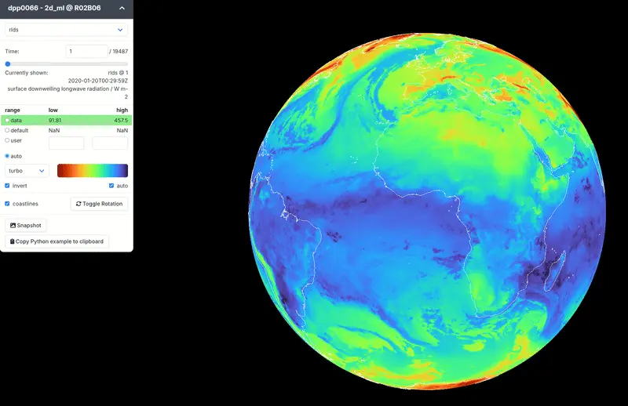

# Fair2Adapt App

WebGL-based interactive globe viewer for FAIR Digital Objects, built on [GridLook](https://github.com/observingClouds/gridlook). Part of the [FAIR2Adapt](https://fair2adapt-eosc.eu) project.

Supports HEALPix DGGS (including multiscale pyramids), curvilinear, regular, triangular, Gaussian reduced, and irregular grids from cloud-hosted Zarr datasets.



## Features

- **Multiple grid types**: HEALPix, curvilinear, regular, triangular, Gaussian reduced, irregular
- **Token authentication**: access private datasets via `::token=` URL parameter
- **RO-Crate resolution**: paste an RO-Crate PID to auto-discover and load the dataset
- **Interactive controls**: colormaps, bounds, projections, time/dimension slicing
- **MapLibre basemaps**: OSM, EMODNET bathymetry, satellite
- **Interactive charts**: pick a location, bounding box or polygon; plot over time (or other dimension, e.g. depth)

## Try It Live

**Dashboard**: https://f2a.plan4all.eu/

<!-- **With FDO2map**: https://fair2adapt.github.io/FDO2map/ — paste an RO-Crate PID to resolve and visualize -->

### Example datasets


RiOMAR ocean model (HEALPix)
https://f2a.plan4all.eu/#https://pangeo-eosc-minioapi.vm.fedcloud.eu/afouilloux-riomar/small_hp_pyramid.zarr

RiOMAR ocean model 2 (HEALPix)
https://f2a.plan4all.eu/#https://pangeo-eosc-minioapi.vm.fedcloud.eu/afouilloux-riomar/small_test1_hp_fixed.zarr

Private dataset with API key
https://fair2adapt.github.io/riomar-dashboard/#https://fair2adapt.duckdns.org/bucket/dataset.zarr::token=YOUR_API_KEY


## URL format

```
https://f2a.plan4all.eu/#<ZARR_URL>::param1=value1::param2=value2
```

| Parameter | Description |
|-----------|-------------|
| `token` | API key for authenticated proxy |
| `varname` | Variable to display |
| `colormap` | Colormap name |
| `boundlow` / `boundhigh` | Color scale bounds |

## Installation

Requires [Node.js](https://nodejs.org/) (v18+) and [npm](https://www.npmjs.com/).

```bash
git clone https://github.com/LESPROJEKT/fair2adapt-app
cd fair2adapt-app
npm install
```

## Development

```bash
npm run dev        # Dev server on localhost:5173
npm run build      # Production build
npm run typecheck  # Type checking
npm run lint       # Linting
```

## Deployment

The dashboard is deployed as a static site via the `deploy-lesprojekt.yml` workflow.

To deploy elsewhere, run `npm run build` and serve the `dist/` directory.

## Acknowledgements

Based on [GridLook](https://github.com/observingClouds/gridlook) by Tobias Kölling and contributors. Extended with RO-Crate resolution, token authentication, and MapLibre basemaps for the FAIR2Adapt project.

## License

[MIT](LICENSE)